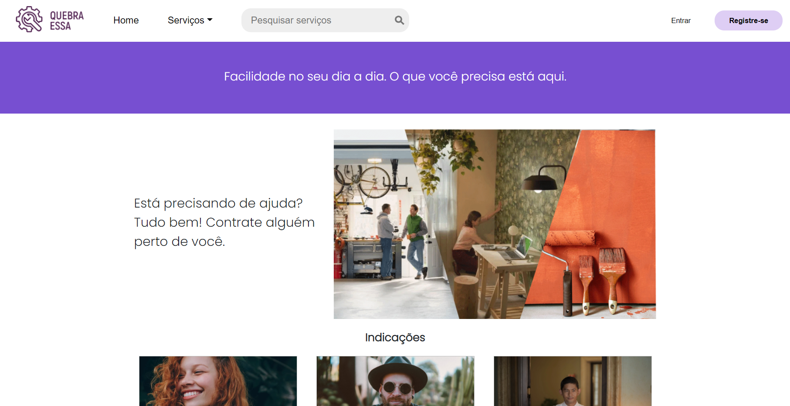

# Quebra essa

Uma aplicação web feita com o objetivo de facilitar a busca de profissionais que oferecem serviços diversos.

  

## Tecnologias utilizadas

- VS code (Editor de texto)
- React (Biblioteca JS)
- Next.js (Framework React)
- Vercel (Plataforma de deploy)
- Styled Components(Biblioteca CSS in JS)
- Bootstrap (Framework CSS)
- Git (Controle de versão)
- Github (Gerenciamento do projeto)

## Instalação

1. Clone o projeto
2. Na pasta do projeto instale as dependências com o comando `npm install` ou `yarn`
3. Para rodar o projeto localmente use o comando `npm run dev` ou `yarn dev`

---

Projeto feito duranto o Hackaton da [Hub Salvador](https://hubsalvador.com.br)

Feito por: [João Vitor](https://github.com/joaovictorbrito), [Philipe Santos](https://github.com/philipe02), [Rodrigo Muniz](https://github.com/CristicoF), Moisés e Lucas.
